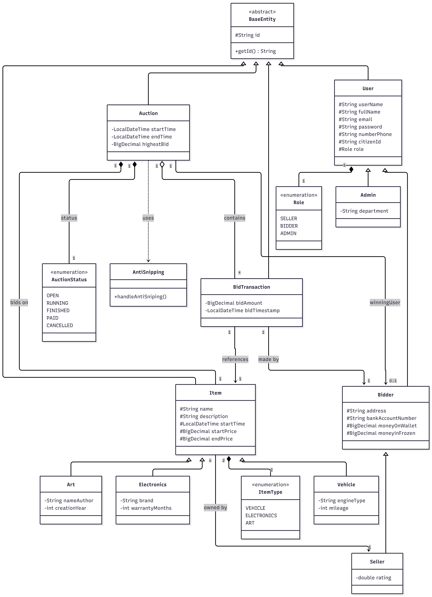
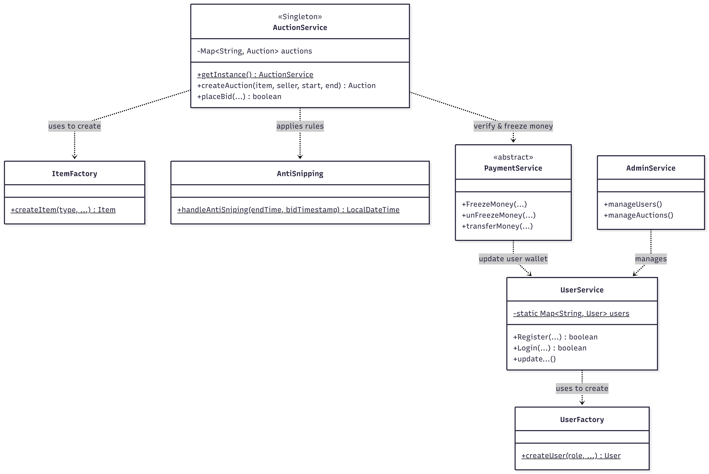

## MajorAssignment_Group1
**Java + JavaFX Major Assignment**: E-Auction System

## Thành viên nhóm (Group 1)
* **[Vũ Đức Trung]** - *Lead Backend* 
* **[Phan Văn Tuyến]** - *Developer - Backend*
* **[Hồ Tú An]** - *Developer - JavaFX Frontend*
* **[Đậu Thu Thảo]** - *Developer - JavaFX Frontend*
---

## 🚀 Công nghệ sử dụng (Tech Stack)
* **Ngôn ngữ:** Java 
* **Backend Framework:** Spring Boot 3.x (Spring Data JPA, Spring Web)
* **Frontend:** JavaFX
* **Cơ sở dữ liệu (Database):** MySQL
* **Công cụ quản lý:** Maven
* **Kiến trúc:** MVC, Factory Pattern

##  Kiến trúc hệ thống (System Architecture)

### Sơ đồ Lớp (Class Diagram)

## 📌 Trạng thái dự án (Project Status: Work in Progress)
- [x] Thiết kế kiến trúc (Sơ đồ Class, Database).
- [x] Chuyển đổi mã nguồn sang Spring Boot.
- [x] Phân quyền người dùng (User, Admin, Bidder, Seller).
- [x] Xây dựng chức năng Đấu giá (Auction) 
- [x] Ghép nối giao diện JavaFX - *Sắp tới*